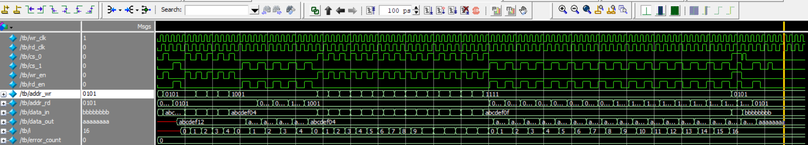
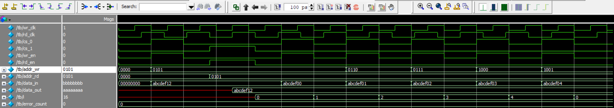
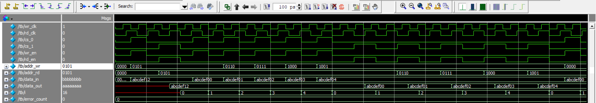
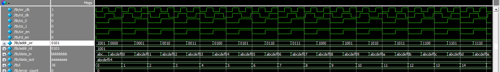
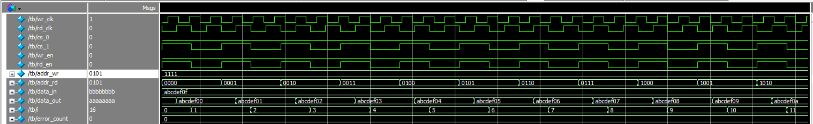
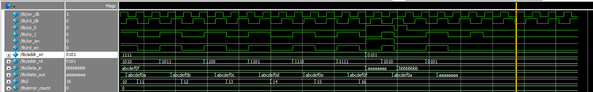

# Synchronous Simple Dual-Port RAM — Verilog

## 1. Project Name

**Synchronous Simple Dual-Port RAM Design and Verification using Verilog**

---

## 2. Project Overview

This project implements a **Synchronous Simple Dual-Port RAM (SDP RAM)** using Verilog HDL and verifies its functionality using a Verilog-based testbench.

The RAM provides two independent ports:

* **Write Port:** Used to write data into memory using `wr_clk`.
* **Read Port:** Used to read data from memory using `rd_clk`.

The write and read operations are synchronous to their respective clock signals. The read data is registered and becomes available after the active edge of the read clock.

### Memory Configuration

| Parameter     |        Value |
| ------------- | -----------: |
| Data Width    |      32 bits |
| Address Width |       4 bits |
| Memory Depth  | 16 locations |
| Total Storage | 16 × 32 bits |
| Write Clock   |     `wr_clk` |
| Read Clock    |     `rd_clk` |

---

## 3. Objectives

The main objectives of this project are:

* Design a parameterized synchronous simple dual-port RAM using Verilog.
* Implement independent write and read clock domains.
* Implement synchronous write operation.
* Implement synchronous registered read operation.
* Verify chip-select and enable controls.
* Verify single and multiple memory accesses.
* Verify all memory locations.
* Verify simultaneous read and write operations.
* Develop a self-checking Verilog testbench.
* Detect verification failures using an error counter.
* Analyze RTL behavior using ModelSim waveforms.

---

# 6. Block Diagram / Architecture

The Synchronous Simple Dual-Port RAM consists of two independent ports: a **write port** and a **read port**. Each port operates using its own clock and control signals.

```text
                         SYNCHRONOUS SIMPLE DUAL-PORT RAM
                    ┌─────────────────────────────────────────┐
                    │                                         │
                    │              MEMORY ARRAY               │
                    │                                         │
                    │           16 × 32-bit RAM               │
                    │                                         │
                    │       Address Range: 0 – 15              │
                    │                                         │
                    └──────────────────┬──────────────────────┘
                                       │
                         ┌─────────────┴─────────────┐
                         │                           │
                         │                           │
                  WRITE PORT                   READ PORT
                         │                           │
       ┌─────────────────┴──────────┐    ┌──────────┴─────────────────┐
       │                            │    │                            │
       │       Write Control        │    │        Read Control        │
       │                            │    │                            │
       │  wr_clk                    │    │  rd_clk                    │
       │  cs_0                      │    │  cs_1                      │
       │  wr_en                     │    │  rd_en                     │
       │                            │    │                            │
       └──────────────┬─────────────┘    └─────────────┬──────────────┘
                      │                                │
                      │                                │
                ┌─────▼─────┐                    ┌─────▼─────┐
                │ addr_wr   │                    │ addr_rd   │
                │ data_in   │                    │ data_out  │
                └───────────┘                    └───────────┘
                      │                                │
                      │ WRITE                          │ READ
                      │                                │
                      ▼                                ▼
                ┌───────────┐                    ┌───────────┐
                │ Write on  │                    │ Read on   │
                │ posedge   │                    │ posedge   │
                │ wr_clk    │                    │ rd_clk    │
                └───────────┘                    └───────────┘
```

## Architecture Description

### 1. Write Port

The write port accepts:

* `wr_clk`
* `cs_0`
* `wr_en`
* `addr_wr`
* `data_in`

A write operation occurs when:

```text
cs_0 = 1
wr_en = 1
```

at the **positive edge of `wr_clk`**.

The input data is stored at the selected memory address.

```text
data_in ──► Memory[addr_wr]
                 ▲
                 │
            posedge wr_clk
```

---

### 2. Memory Array

The RAM contains:

```text
DEPTH      = 16
DATA_WIDTH = 32 bits
```

Therefore, the memory organization is:

```text
Memory = 16 × 32 bits
```

The 4-bit address selects one of the 16 memory locations:

```text
0000 → Location 0
0001 → Location 1
0010 → Location 2
...
1111 → Location 15
```

---

### 3. Read Port

The read port accepts:

* `rd_clk`
* `cs_1`
* `rd_en`
* `addr_rd`

A read operation occurs when:

```text
cs_1 = 1
rd_en = 1
```

at the **positive edge of `rd_clk`**.

The selected memory data is captured into the registered output `data_out`.

```text
Memory[addr_rd] ──► data_out
                         ▲
                         │
                    posedge rd_clk
```

---

### 4. Independent Clock Domains

The write and read ports operate using separate clocks:

```text
Write Port → wr_clk
Read Port  → rd_clk
```

In this project:

```text
wr_clk period = 10 ns
rd_clk period = 14 ns
```

Therefore, the write and read operations can occur independently.

---

### 5. Overall Data Flow

```text
                    WRITE PATH

data_in ──► addr_wr ──► WRITE PORT ──► MEMORY ARRAY
                         ▲
                         │
                       wr_clk


                    READ PATH

MEMORY ARRAY ──► addr_rd ──► READ PORT ──► data_out
                              ▲
                              │
                            rd_clk
```

This architecture allows the RAM to perform **independent synchronous write and read operations through separate ports and clocks**.


## 4. Technologies Used

### HDL

* Verilog HDL

### Simulation Tool

* Siemens ModelSim

### Verification

* Verilog-based self-checking testbench
* Directed test cases
* Expected-versus-actual data comparison
* Error counting

### Supporting Files

* `run.do` — ModelSim simulation script
* `.gitignore` — Git-generated/simulation-file exclusion

---

## 5. Key Verification Features

The testbench verifies the following RAM functionality:

* Single write operation
* Single read operation
* Multiple write operations
* Multiple read operations
* Write to all 16 memory locations
* Read from all 16 memory locations
* Simultaneous write and read operations
* Write enable disabled condition
* Read enable disabled condition
* Chip-select controlled operation
* Expected-versus-actual data comparison
* Automatic error counting
* Final PASS/FAIL result

The testbench uses case equality (`===`) for data comparison so that unknown (`X`) and high-impedance (`Z`) values can also be detected during verification.

---

## 6. RAM Interface Signals

| Signal     | Direction | Width | Description            |
| ---------- | --------- | ----: | ---------------------- |
| `wr_clk`   | Input     |     1 | Write clock            |
| `cs_0`     | Input     |     1 | Write-port chip select |
| `wr_en`    | Input     |     1 | Write enable           |
| `addr_wr`  | Input     |     4 | Write address          |
| `data_in`  | Input     |    32 | Data to be written     |
| `rd_clk`   | Input     |     1 | Read clock             |
| `cs_1`     | Input     |     1 | Read-port chip select  |
| `rd_en`    | Input     |     1 | Read enable            |
| `addr_rd`  | Input     |     4 | Read address           |
| `data_out` | Output    |    32 | Registered read data   |

---

## 7. RAM Operation

### Write Operation

A write occurs on the positive edge of `wr_clk` when both `cs_0` and `wr_en` are asserted.

```verilog
always @(posedge wr_clk) begin
    if (cs_0 && wr_en) begin
        memory[addr_wr] <= data_in;
    end
end
```

Therefore:

```text
cs_0 = 1
wr_en = 1
        +
posedge wr_clk
        ↓
Data written into memory
```

---

### Read Operation

A read occurs on the positive edge of `rd_clk` when both `cs_1` and `rd_en` are asserted.

```verilog
always @(posedge rd_clk) begin
    if (cs_1 && rd_en) begin
        data_out <= memory[addr_rd];
    end
end
```

Therefore:

```text
cs_1 = 1
rd_en = 1
        +
posedge rd_clk
        ↓
Memory data captured into data_out
```

The read output is registered, making this a **synchronous read RAM**.

---

# 8. Verification Environment

The project uses a **Verilog-based directed verification environment**.

```text
                    +----------------------+
                    |    Testbench         |
                    |                      |
                    |  Clock Generation    |
                    |  Test Tasks           |
                    |  Expected Data        |
                    |  Error Checking       |
                    +----------+-----------+
                               |
                               |
                        DUT Interface
                               |
                               ↓
              +-------------------------------+
              |      Synchronous SDP RAM       |
              |                               |
              |   Write Port   Read Port      |
              |      ↓             ↓          |
              |   wr_clk         rd_clk       |
              |   wr_en          rd_en        |
              |   cs_0           cs_1         |
              |   addr_wr        addr_rd      |
              |   data_in        data_out     |
              +-------------------------------+
```

### Testbench Components

The testbench contains:

* Independent write clock generation
* Independent read clock generation
* Write task
* Read task
* Directed test scenarios
* Expected data checking
* Error counter
* Final PASS/FAIL reporting

---

# 9. Test Cases

## Test Case 1 — Single Write

### Objective

Verify that data can be successfully written to an individual memory address.

### Example

```text
Address = 5
Data    = ABCDEF12
```

Expected result:

```text
Memory[5] = ABCDEF12
```

---

## Test Case 2 — Single Read

### Objective

Verify that previously written data can be read correctly from a single memory location.

### Example

```text
Address  = 5
Expected = ABCDEF12
```

Expected result:

```text
data_out = ABCDEF12
```

---

## Test Case 3 — Multiple Write

### Objective

Verify that multiple memory locations can be written with different data values.

Example:

```text
Address     Data
5           ABCDEF00
6           ABCDEF01
7           ABCDEF02
8           ABCDEF03
9           ABCDEF04
```

Expected result:

```text
Memory[5] = ABCDEF00
Memory[6] = ABCDEF01
Memory[7] = ABCDEF02
Memory[8] = ABCDEF03
Memory[9] = ABCDEF04
```

---

## Test Case 4 — Multiple Read

### Objective

Verify that multiple previously written memory locations can be read correctly.

The testbench compares:

```text
Expected Data
     vs
Actual data_out
```

for each address.

---

## Test Case 5 — All Writes

### Objective

Verify write functionality for all memory locations.

Since the RAM contains 16 locations:

```text
Address 0 → Data
Address 1 → Data
Address 2 → Data
...
Address 15 → Data
```

All 16 locations are written sequentially.

---

## Test Case 6 — All Reads

### Objective

Verify that data stored in all 16 memory locations can be read correctly.

The testbench reads:

```text
Address 0
Address 1
Address 2
...
Address 15
```

and compares each result with its expected value.

---

## Test Case 7 — Simultaneous Write and Read

### Objective

Verify that the independent write and read ports can operate at the same time.

Example:

```text
Write:
Address = 5
Data    = AAAAAAAA

Read:
Address = 10
```

The test verifies that:

```text
Memory[5] ← AAAAAAAA
data_out  = data previously stored at Memory[10]
```

Because the write and read ports use independent clocks, write and read operations can occur concurrently.

---

## Test Case 8 — Write Enable Disabled

### Objective

Verify that no write occurs when `wr_en = 0`.

Example:

```text
cs_0    = 1
wr_en   = 0
addr_wr = 5
data_in = BBBBBBBB
```

Expected behavior:

```text
Memory[5] remains unchanged
```

The testbench subsequently reads address 5 and verifies that the previous data is still present.

---

## Test Case 9 — Read Enable Disabled

### Objective

Verify that `data_out` does not update when `rd_en = 0`.

Expected behavior:

```text
rd_en = 0
        ↓
No new read operation
        ↓
data_out remains unchanged
```

---

# 10. Project Structure

```text
sync-sdp-ram/
│
├── rtl/
│   └── sync_sdp_ram.v
│
├── tb/
│   └── tb_sync_sdp_ram.v
│
├── simulation/
│   └── run.do
│
├── waveforms/
│   ├── single_write_read.png
│   ├── multiple_write_read.png
│   ├── all_writes.png
│   ├── all_reads.png
│   └── simultaneous_write_read.png
│
├── README.md
│
└── .gitignore
```

---

# 11. Simulation

The design was simulated using **Siemens ModelSim**.

Two independent clocks are used:

```text
Write Clock:
wr_clk → period = 10 ns

Read Clock:
rd_clk → period = 14 ns
```

This allows the write and read ports to operate using independent clock domains.

The testbench executes all directed test cases and reports the verification result in the ModelSim transcript.

Example final result:

```text
FINAL RESULT
ALL TEST CASES ARE PASSED
error count: 0
```

---

# 12. Simulation Waveforms

```text

```

## 12.1 Single Write and Read

The waveform demonstrates:

* `wr_clk`
* `cs_0`
* `wr_en`
* `addr_wr`
* `data_in`
* `rd_clk`
* `cs_1`
* `rd_en`
* `addr_rd`
* `data_out`

During the write operation, `data_in` is written to the selected address on the positive edge of `wr_clk`.

During the read operation, the stored data appears on `data_out` after the positive edge of `rd_clk`.

### Waveform

Add the ModelSim screenshot here:

```text

```

---

## 12.2 Multiple Write and Read

This waveform demonstrates multiple write and read operations using different addresses and data values.

### Waveform

```text

```

---

## 12.3 All Writes

This waveform demonstrates writing data to all 16 memory locations.

### Waveform

```text

```

---

## 12.4 All Reads

This waveform demonstrates reading data from all 16 memory locations.

### Waveform

```text

```

---

## 12.5 Simultaneous Write and Read

This waveform demonstrates independent write and read operations occurring concurrently using separate clocks.

### Waveform

```text

```

---

# 13. ModelSim Simulation Using `run.do`

The project includes a ModelSim `run.do` script to automate compilation, simulation, waveform addition, and execution.

A typical `run.do` file contains:

```tcl
vlog ../rtl/sync_sdp_ram.v
vlog ../tb/tb_sync_sdp_ram.v

vsim work.tb

add wave -r *

run -all
```

### Command Description

#### `vlog`

Compiles the Verilog source files.

```tcl
vlog ../rtl/sync_sdp_ram.v
vlog ../tb/tb_sync_sdp_ram.v
```

#### `vsim`

Loads the compiled testbench for simulation.

```tcl
vsim work.tb
```

#### `add wave`

Adds signals to the ModelSim waveform window.

```tcl
add wave -r *
```

The `-r` option recursively adds signals from the design hierarchy.

#### `run -all`

Runs the simulation until `$finish` is executed.

```tcl
run -all
```

---

# 14. How to Run the Simulation

## Method 1 — Using ModelSim GUI

Open ModelSim and navigate to the project directory.

Run:

```tcl
do run.do
```

The script will:

```text
Compile RTL
    ↓
Compile Testbench
    ↓
Start Simulation
    ↓
Add Waveforms
    ↓
Run Simulation
    ↓
Display Test Results
```

---

## Method 2 — Using ModelSim Transcript

Execute the following commands manually:

```tcl
vlog ../rtl/sync_sdp_ram.v
vlog ../tb/tb_sync_sdp_ram.v

vsim work.tb

add wave -r *

run -all
```

The transcript displays the individual test results and the final verification status.

---

# 15. Expected Simulation Result

A successful simulation should report:

```text
SINGLE WRITE
WRITE: addr=0101 data=abcdef12

SINGLE READ
READ PASS: addr=0101 expected=abcdef12 data=abcdef12

MULTIPLE WRITES
...

MULTIPLE READ
READ PASS
...

ALL WRITES
...

ALL READS
READ PASS
...

SIMULTANEOUS WRITE AND READ
SIMULTANEOUS READ PASS

WRITE ENABLE=0
write operation is disabled

READ ENABLE=0
previous data is unchanged

FINAL RESULT
ALL TEST CASES ARE PASSED
error count: 0
```

---

# 16. Verification Result

| Verification Category   | Result |
| ----------------------- | ------ |
| Single Write            | PASS   |
| Single Read             | PASS   |
| Multiple Write          | PASS   |
| Multiple Read           | PASS   |
| All 16 Writes           | PASS   |
| All 16 Reads            | PASS   |
| Simultaneous Write/Read | PASS   |
| Write Enable Disabled   | PASS   |
| Read Enable Disabled    | PASS   |
| Final Error Count       | 0      |

---

# 17. Author

**Author:** Sai

**Project:** Synchronous Simple Dual-Port RAM Design and Verification

**HDL:** Verilog

**Simulation Tool:** Siemens ModelSim
